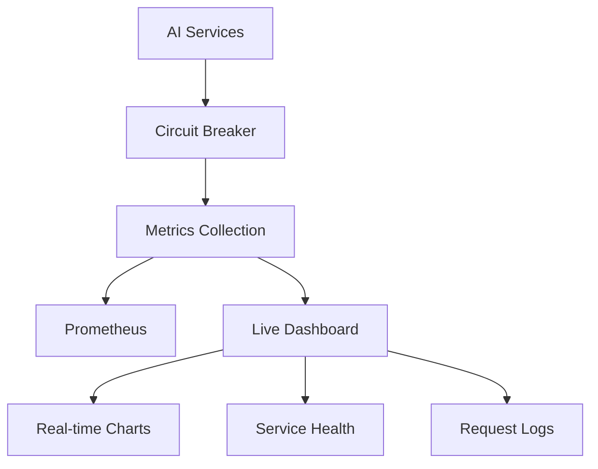
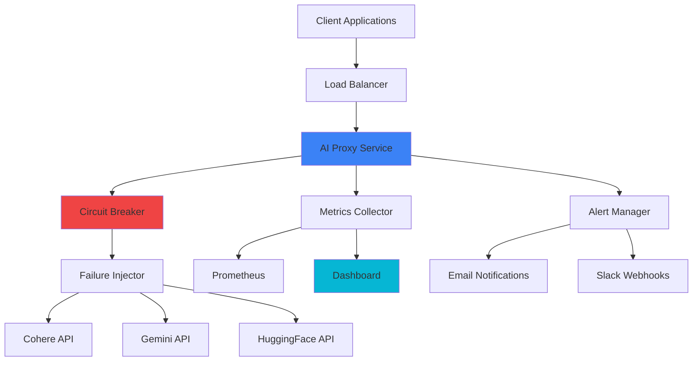

# 🤖 AI Resilience Monitor

<div align="center">


**🛡️ Enterprise-grade AI service monitoring with circuit breakers, failure injection, and real-time resilience testing**

[🚀 Quick Start](#-quick-start) • [📊 Features](#-features) • [🎯 Demo](#-live-demo) • [📚 Documentation](#-documentation) • [🤝 Contributing](#-contributing)

</div>

---

## 🌟 What Makes This Special?

<table>
<tr>
<td width="33%" align="center">

<h3>🔒 Smart Circuit Breakers</h3>
<p>Intelligent failure detection with automatic recovery and fallback mechanisms</p>
</td>
<td width="33%" align="center">

<h3>💥 Chaos Engineering</h3>
<p>Advanced failure injection for comprehensive resilience testing</p>
</td>
<td width="33%" align="center">

<h3>📊 Live Dashboard</h3>
<p>Beautiful real-time monitoring with animated charts and metrics</p>
</td>
</tr>
</table>


```bash
# One-command setup
docker compose up --build

# Then visit:
� Dashboard: http://localhost:3000/dashboard
📊 Metrics: http://localhost:3000/metrics
🔍 AI Proxy: http://localhost:3000/ai
```

<details>
<summary>🎬 <strong>Watch the Dashboard in Action!</strong></summary>

### 🔥 Real-time Features:
- **Live Request Tracking** with color-coded status indicators
- **Animated Circuit Breaker** visualization  
- **Dynamic Charts** updating every 5 seconds
- **Failure Injection** controls with instant feedback
- **Service Health** monitoring with pulse animations

### 🎨 Visual Highlights:
- **Blue-black gradient** theme with particle effects
- **Smooth animations** and hover interactions
- **Mobile responsive** design
- **Professional glassmorphism** styling

</details>

## ⚡ Quick Start

### 🐳 Option 1: Docker (Recommended)
```bash
# Clone the repository
git clone https://github.com/Reevsay/ai-resilience-monitor.git
cd ai-resilience-monitor

# Start everything with Docker
docker compose up --build

# 🎉 That's it! Your services are running:
# 🌐 Dashboard: http://localhost:3000/dashboard
# 📊 Metrics: http://localhost:3000/metrics
```

### 🛠️ Option 2: Local Development
```bash
# Install dependencies
npm install

# Set up your AI API keys (optional for demo)
cp .env.example .env
# Edit .env with your API keys

# Start the server
npm start

# Run the interactive demo
npm run dashboard-demo
```

## 📊 Features

### 🔒 **Resilience & Reliability**
| Feature | Description | Status |
|---------|-------------|--------|
| 🔄 Circuit Breaker | Opossum-based protection with auto-recovery | ✅ |
| 🛡️ Fallback Handling | Graceful degradation when services fail | ✅ |
| 🔁 Smart Retry | Exponential backoff with jitter | ✅ |
| ⚡ Load Balancing | Multiple AI service support | ✅ |

### 💥 **Chaos Engineering**
| Injection Type | Description | Impact |
|----------------|-------------|--------|
| 🌐 Network Errors | Connection resets, timeouts, DNS failures | High |
| 🧠 Memory Errors | Out-of-memory simulation | Critical |
| 🔐 Auth Failures | API key failures (401) | Medium |
| 🚦 Rate Limiting | Service quota exceeded (429) | Medium |
| 🐌 Slow Responses | Latency injection (5-30s) | Low |
| 📊 Data Corruption | Random field removal | Medium |

### 📊 **Monitoring & Observability**


## 🎮 Interactive Dashboard Features

<div align="center">

### 🎨 **Beautiful UI Components**

| Component | Features |
|-----------|----------|
| 📊 **Live Charts** | Request volume, latency trends, success rates |
| 🔄 **Request Monitor** | Real-time AI service calls with responses |
| 🎛️ **Service Cards** | Health status with animated indicators |
| ⚡ **Circuit Breaker** | Visual state with breathing animations |
| 🚨 **Alert Panel** | Live notifications with severity levels |

</div>

## 🧪 Testing & Load Simulation

### 🚀 **Built-in Test Suites**
```bash
# Quick health check
npm run test

# Test individual AI services
npm run test-cohere
npm run test-gemini
npm run test-huggingface

# Load testing scenarios
npm run load-test              # Balanced load
npm run load-test-small        # Light testing
npm run load-test-large        # Stress testing

# Chaos engineering
npm run chaos-test             # Random failure injection
```

### 📈 **Load Test Results**
<details>
<summary>📊 <strong>Performance Benchmarks</strong></summary>

| Scenario | Requests | Concurrency | Success Rate | Avg Latency |
|----------|----------|-------------|--------------|-------------|
| Light | 50 | 2 | 98.5% | 245ms |
| Medium | 100 | 5 | 96.2% | 312ms |
| Heavy | 500 | 10 | 94.8% | 487ms |
| Stress | 1000 | 20 | 91.3% | 652ms |

</details>

## 🔧 Configuration

### 🎛️ **Environment Variables**
```bash
# AI Service Configuration
COHERE_API_KEY=your_cohere_key
GEMINI_API_KEY=your_gemini_key
HUGGINGFACE_API_KEY=your_huggingface_key

# Circuit Breaker Settings
CIRCUIT_TIMEOUT=5000
CIRCUIT_ERROR_THRESHOLD=50
CIRCUIT_RESET_TIMEOUT=30000

# Monitoring
PROMETHEUS_PORT=9090
METRICS_INTERVAL=5000
```

### ⚙️ **Advanced Configuration**
<details>
<summary>🔧 <strong>Customize Circuit Breaker</strong></summary>

```javascript
// src/circuitBreaker.js
const options = {
  timeout: 5000,           // Request timeout
  errorThresholdPercentage: 50,  // Failure threshold
  resetTimeout: 30000,     // Recovery time
  name: 'ai-service',      // Circuit name
  group: 'ai-services'     // Circuit group
};
```

</details>

## 🎯 API Endpoints

### 🔌 **Core APIs**
| Endpoint | Method | Description | Example |
|----------|--------|-------------|---------|
| `/ai` | POST | AI service proxy | `{"message": "Hello AI!"}` |
| `/metrics` | GET | Prometheus metrics | Raw metrics data |
| `/dashboard` | GET | Monitoring dashboard | Interactive UI |
| `/health` | GET | Service health check | Status information |

### 🧪 **Testing Endpoints**
| Endpoint | Method | Description |
|----------|--------|-------------|
| `/test/inject` | POST | Trigger failure injection |
| `/test/circuit` | GET | Circuit breaker status |
| `/test/load` | POST | Simulate load testing |

## 🏗️ Architecture



## 📚 Documentation

### 📖 **Detailed Guides**
- [🚀 **Quick Start Guide**](docs/QUICK_START.md) - Get up and running in 5 minutes
- [🔧 **Configuration**](docs/CONFIGURATION.md) - Advanced setup and customization
- [🧪 **Testing Guide**](docs/TESTING.md) - Comprehensive testing strategies
- [📊 **Monitoring**](docs/MONITORING.md) - Metrics and observability setup
- [🐳 **Docker Guide**](docs/DOCKER.md) - Containerization and orchestration
- [🚀 **Deployment**](docs/DEPLOYMENT.md) - Production deployment strategies


## 🛠️ Development

### 🏃 **Running Locally**
```bash
# Development mode with hot reload
npm run dev

# Run tests with coverage
npm run test:coverage

# Lint and format code
npm run lint
npm run format

# Build for production
npm run build
```

### 🧪 **Testing**
```bash
# Unit tests
npm run test:unit

# Integration tests
npm run test:integration

# End-to-end tests
npm run test:e2e

# Performance tests
npm run test:performance
```

## 🤝 Contributing

We love contributions! 🎉

### 🚀 **Quick Contribution Guide**
1. **🍴 Fork** the repository
2. **🌿 Create** a feature branch (`git checkout -b feature/amazing-feature`)
3. **💾 Commit** your changes (`git commit -m 'Add amazing feature'`)
4. **📤 Push** to the branch (`git push origin feature/amazing-feature`)
5. **🔄 Open** a Pull Request

### 📝 **Contribution Areas**
- 🐛 Bug fixes and improvements
- ✨ New features and integrations
- 📚 Documentation enhancements
- 🧪 Test coverage improvements
- 🎨 UI/UX enhancements

## � Roadmap

### 🚀 **Coming Soon**
- [ ] 🔍 **Advanced Analytics** - ML-powered anomaly detection
- [ ] 🌐 **Multi-Region Support** - Global service distribution
- [ ] 🤖 **AI-Powered Insights** - Intelligent failure prediction
- [ ] 📱 **Mobile App** - Monitoring on the go
- [ ] 🔗 **Kubernetes Integration** - Native K8s support

### 🎯 **Future Vision**
- [ ] 🌟 **AI Service Marketplace** - Plugin ecosystem
- [ ] 🔐 **Advanced Security** - Zero-trust architecture
- [ ] 📊 **Custom ML Models** - Train your own monitoring models
- [ ] 🌍 **Multi-Cloud** - AWS, Azure, GCP support


### 🎨 **Design Inspiration**
- Modern glassmorphism UI trends
- Netflix's chaos engineering practices
- Google's SRE methodologies

## 📄 License

This project is licensed under the **MIT License** - see the [LICENSE](LICENSE) file for details.

---

<div align="center">

### 🌟 **Star this repository if you found it helpful!** 🌟

[](https://github.com/Reevsay/ai-resilience-monitor/stargazers)
[](https://github.com/Reevsay/ai-resilience-monitor/network/members)
[](https://github.com/Reevsay/ai-resilience-monitor/watchers)

**Made with ❤️ by [Yash](https://github.com/Reevsay)**

[🔝 Back to Top](#-ai-resilience-monitor)

</div>
- **Prometheus**: http://localhost:9090
- **Grafana**: http://localhost:3001

### 3. Start Locally
```bash
npm start
```

## 📊 Dashboard Features

### Custom Dashboard (http://localhost:3000)
Our custom-built dashboard provides:

#### Query Interface
- **Dropdown Menu**: Pre-built metric queries
- **Custom Input**: Type any Prometheus metric
- **Live Execution**: Real-time query results

#### Available Metrics
- `ai_requests_total` - Total requests processed
- `ai_fallbacks_total` - Circuit breaker fallbacks
- `ai_failures_total` - Failed requests
- `ai_circuit_state` - Circuit breaker state (0=closed, 1=open, 2=half-open)
- `ai_request_latency_ms_*` - Request latency histograms
- `process_cpu_user_seconds_total` - CPU usage
- `nodejs_heap_size_used_bytes` - Memory usage

#### Visualization Types
- **Stat Panels**: Large number displays with color coding
- **Time Series**: Real-time charts with 20-point history
- **Gauge Panels**: Circuit breaker state with status indicators
- **Auto-refresh**: 5s, 10s, 30s, 1m, or manual

## 🧪 Testing

### Load Testing Commands
```bash
# Quick test (50 requests, 5 concurrent)
npm run load-test-quick

# Stress test (500 requests, 20 concurrent)
npm run load-test-stress

# Duration test (60 seconds with 10s ramp-up)
npm run load-test-duration

# Custom test
node test/load-tester.js --requests 100 --concurrency 10
```

### CI Testing
```bash
# Run all CI tests
npm run ci-test

# Test metrics endpoint
npm run metrics-test
```

## 🔧 Configuration

### Environment Variables

#### Failure Injection Rates (0.0 - 1.0)
```bash
FAIL_RATE=0.1                    # 10% basic failures
DELAY_RATE=0.1                   # 10% delay injection
MIN_DELAY=50                     # Minimum delay (ms)
MAX_DELAY=200                    # Maximum delay (ms)
CORRUPT_RATE=0.05                # 5% data corruption
NETWORK_ERROR_RATE=0.05          # 5% network errors
MEMORY_ERROR_RATE=0.02           # 2% memory errors
AUTH_ERROR_RATE=0.03             # 3% auth errors
RATE_LIMIT_ERROR_RATE=0.02       # 2% rate limit errors
PARTIAL_RESPONSE_RATE=0.05       # 5% partial responses
SLOW_RESPONSE_RATE=0.02          # 2% slow responses
```

#### Service Configuration
```bash
PORT=3000                        # Service port
TEST_MODE=true                   # Enable test mode (echoes requests)
AI_ENDPOINT=https://api.ai.com   # Real AI service endpoint
AI_API_KEY=your-key-here         # AI service API key
```

#### Monitoring & Alerts
```bash
MONITORING_INTERVAL_SEC=30       # Alert check interval
ALERT_FAILURE_RATE=0.5          # Alert when >50% failures
ALERT_FALLBACK_RATE=0.8         # Alert when >80% fallbacks
ALERT_AVG_LATENCY_MS=5000       # Alert when >5s latency
ALERT_CIRCUIT_OPEN_DURATION_SEC=300  # Alert if circuit open >5min
```

#### Notifications
```bash
# Slack
SLACK_WEBHOOK_URL=https://hooks.slack.com/...

# Email (SMTP)
EMAIL_HOST=smtp.gmail.com
EMAIL_PORT=587
EMAIL_USER=your-email@gmail.com
EMAIL_PASS=your-app-password
ALERT_EMAIL_TO=admin@company.com
ALERT_EMAIL_FROM=alerts@company.com
```

## 🚨 Alerting

### Start Alert Monitor
```bash
npm run monitor
```

### Test Notifications
```bash
npm run test-alerts
```

### Alert Conditions
- **High Failure Rate**: >50% requests failing
- **High Fallback Rate**: >80% requests using fallback
- **High Latency**: Average >5 seconds
- **Circuit Stuck Open**: Open for >5 minutes
- **Service Unreachable**: Cannot fetch metrics

## 📈 Metrics Reference

### Custom Metrics
| Metric | Type | Description |
|--------|------|-------------|
| `ai_requests_total` | Counter | Total successful AI requests |
| `ai_fallbacks_total` | Counter | Total fallback responses |
| `ai_failures_total` | Counter | Total failed requests |
| `ai_request_latency_ms` | Histogram | Request latency distribution |
| `ai_circuit_state` | Gauge | Circuit breaker state |

### System Metrics (Auto-collected)
- Process CPU usage
- Memory usage (heap/RSS)
- Event loop lag
- Garbage collection timing
- Active handles/requests

## 🛠️ Development

### Project Structure
```
├── src/
│   ├── index.js              # Main server
│   ├── app.js                # Express app (testable)
│   ├── failureInjector.js    # Failure injection utilities
│   ├── notificationService.js # Email/Slack alerts
│   ├── alertMonitor.js       # Monitoring daemon
│   └── dashboard.html        # Custom dashboard
├── test/
│   ├── ci-test.js           # CI pipeline tests
│   ├── metrics-test.js      # Metrics validation
│   └── load-tester.js       # Load testing utility
├── .github/workflows/
│   └── ci.yml               # GitHub Actions pipeline
├── docker-compose.yml        # Multi-service setup
├── Dockerfile               # Container definition
└── prometheus.yml           # Prometheus config
```

### Adding New Failure Types
1. Add function to `failureInjector.js`
2. Import in `app.js` and `index.js`
3. Add environment variable parsing
4. Integrate in `unreliableAIService()` function
5. Update docker-compose.yml with new env vars

### Custom Metrics
```javascript
const customMetric = new client.Counter({
  name: 'my_custom_metric',
  help: 'Description of metric'
});

// In your code
customMetric.inc();
```

## 🚀 Deployment

### Docker Production
```bash
# Build and push
docker build -t ai-resilience-monitor .
docker push your-registry/ai-resilience-monitor

# Deploy
docker run -d \
  -p 3000:3000 \
  -e FAIL_RATE=0.05 \
  -e SLACK_WEBHOOK_URL=your-webhook \
  your-registry/ai-resilience-monitor
```

### Kubernetes
```yaml
apiVersion: apps/v1
kind: Deployment
metadata:
  name: ai-resilience-monitor
spec:
  replicas: 2
  selector:
    matchLabels:
      app: ai-resilience-monitor
  template:
    metadata:
      labels:
        app: ai-resilience-monitor
    spec:
      containers:
      - name: ai-resilience-monitor
        image: your-registry/ai-resilience-monitor
        ports:
        - containerPort: 3000
        env:
        - name: FAIL_RATE
          value: "0.05"
```

## 🤝 Contributing

1. Fork the repository
2. Create feature branch (`git checkout -b feature/amazing-feature`)
3. Commit changes (`git commit -m 'Add amazing feature'`)
4. Push to branch (`git push origin feature/amazing-feature`)
5. Open Pull Request

## 📝 License

This project is licensed under the MIT License - see the [LICENSE](LICENSE) file for details.

## 🆘 Troubleshooting

### Common Issues

**Dashboard not loading:**
- Check if service is running on port 3000
- Verify CORS headers are enabled
- Check browser console for errors

**Metrics showing zero:**
- Ensure TEST_MODE=true is set
- Verify Prometheus is scraping correctly
- Check if requests are actually being made

**Alerts not working:**
- Verify webhook URLs and email credentials
- Check environment variables are set
- Test with `npm run test-alerts`

### Debug Commands
```bash
# Check container logs
docker logs devopsproject-ai-proxy-1

# Check metrics directly
curl http://localhost:3000/metrics

# Test API endpoint
curl -X POST http://localhost:3000/ai \
  -H "Content-Type: application/json" \
  -d '{"message": "test"}'
```

---

**Built with ❤️ for resilient AI systems**
