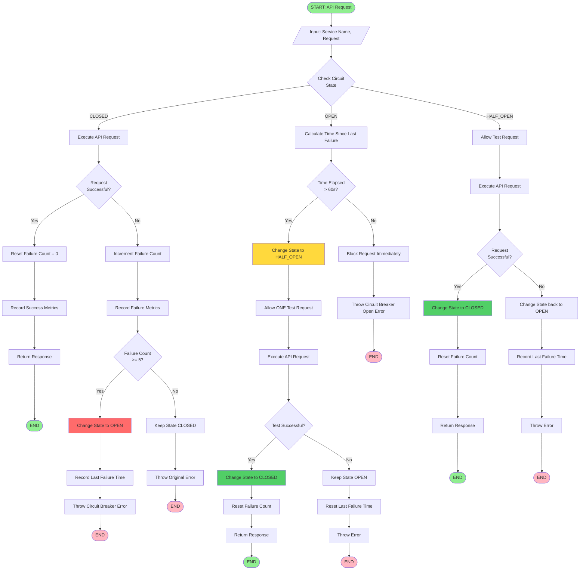
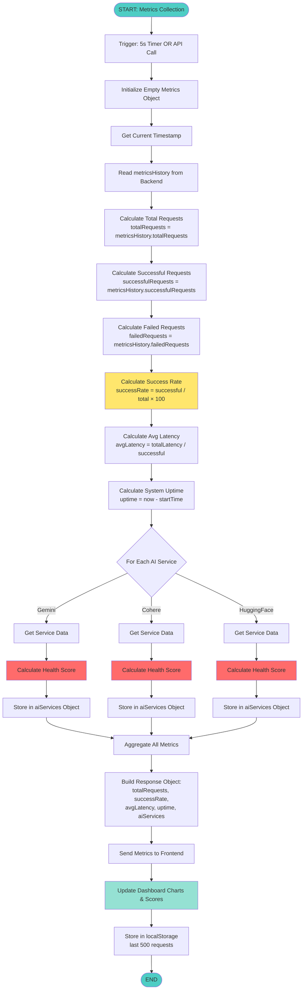
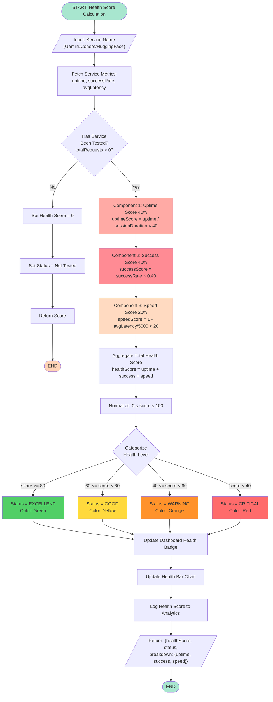
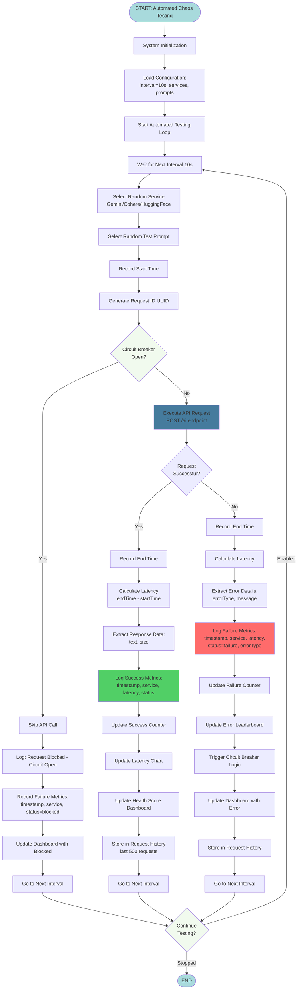
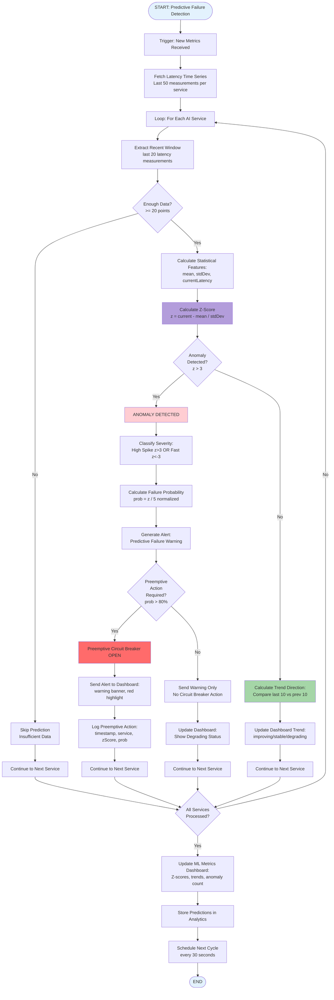

# Flowchart Creation Prompts - AI Resilience Monitor Procedures
**Date:** October 6, 2025  
**Project:** AI Service Resilience Monitor  
**Total Procedures:** 4 Core Procedures

---

## How to Use These Prompts

### **Option 1: AI Tools (ChatGPT, Claude, etc.)**
Copy the prompt → Paste into ChatGPT/Claude → Request Mermaid diagram code → Paste code into https://mermaid.live/ → Export as PNG

### **Option 2: Draw.io / Lucidchart**
Use the detailed steps in each prompt to manually create flowchart

### **Option 3: PowerPoint / Google Slides**
Follow the component descriptions to build flowchart using shapes

---

## Procedure 1: Circuit Breaker Pattern

### 🎨 AI Prompt for Flowchart Generation

```
Create a detailed flowchart for a Circuit Breaker pattern used in an AI service resilience monitoring system. The flowchart should show:

START
↓
[Input: Service Name, API Request]
↓
{Decision: Check Circuit State}
├─ If CLOSED:
│   ↓
│   [Execute API Request to AI Service]
│   ↓
│   {Decision: Request Successful?}
│   ├─ Yes:
│   │   ↓
│   │   [Reset Failure Count = 0]
│   │   ↓
│   │   [Record Success Metrics (latency, timestamp)]
│   │   ↓
│   │   [Return Response to Client]
│   │   ↓
│   │   END
│   │
│   └─ No (Error/Timeout):
│       ↓
│       [Increment Failure Count]
│       ↓
│       [Record Failure Metrics (error type, timestamp)]
│       ↓
│       {Decision: Failure Count >= Threshold (5)?}
│       ├─ Yes:
│       │   ↓
│       │   [Change State to OPEN]
│       │   ↓
│       │   [Record Last Failure Time]
│       │   ↓
│       │   [Throw Circuit Breaker Error]
│       │   ↓
│       │   END
│       │
│       └─ No:
│           ↓
│           [Keep State CLOSED]
│           ↓
│           [Throw Original Error]
│           ↓
│           END
│
├─ If OPEN:
│   ↓
│   [Calculate: Time Since Last Failure]
│   ↓
│   {Decision: Time Elapsed > Timeout (60s)?}
│   ├─ Yes:
│   │   ↓
│   │   [Change State to HALF_OPEN]
│   │   ↓
│   │   [Allow ONE Test Request]
│   │   ↓
│   │   [Execute API Request]
│   │   ↓
│   │   {Decision: Test Request Successful?}
│   │   ├─ Yes:
│   │   │   ↓
│   │   │   [Change State to CLOSED]
│   │   │   ↓
│   │   │   [Reset Failure Count = 0]
│   │   │   ↓
│   │   │   [Return Response]
│   │   │   ↓
│   │   │   END
│   │   │
│   │   └─ No:
│   │       ↓
│   │       [Keep State OPEN]
│   │       ↓
│   │       [Record Last Failure Time (reset timeout)]
│   │       ↓
│   │       [Throw Error]
│   │       ↓
│   │       END
│   │
│   └─ No:
│       ↓
│       [Block Request Immediately]
│       ↓
│       [Throw "Circuit Breaker Open" Error]
│       ↓
│       END
│
└─ If HALF_OPEN:
    ↓
    [Allow Test Request]
    ↓
    [Execute API Request]
    ↓
    {Decision: Request Successful?}
    ├─ Yes:
    │   ↓
    │   [Change State to CLOSED]
    │   ↓
    │   [Reset Failure Count]
    │   ↓
    │   [Return Response]
    │   ↓
    │   END
    │
    └─ No:
        ↓
        [Change State back to OPEN]
        ↓
        [Record Last Failure Time]
        ↓
        [Throw Error]
        ↓
        END

Use these symbols:
- START/END: Rounded rectangles (oval)
- Process boxes: Rectangles
- Decisions: Diamonds
- Data: Parallelograms
- Arrows: Solid lines with arrowheads
- States: Bold boxes with colors (CLOSED=Green, OPEN=Red, HALF_OPEN=Yellow)

Color scheme:
- Success paths: Green
- Failure paths: Red
- Decision paths: Blue
- State transitions: Orange

Generate Mermaid flowchart code for this.
```

---

### 📊 Mermaid Code (Copy-Paste Ready)



---

## Procedure 2: Metrics Collection & Aggregation

### 🎨 AI Prompt for Flowchart Generation

```
Create a flowchart for the Metrics Collection and Aggregation procedure in an AI resilience monitoring system. Show:

START
↓
[Trigger: Timer (5-second interval) OR API Call]
↓
[Initialize Empty Metrics Object]
↓
[Get Current Timestamp]
↓
[Read metricsHistory from Backend]
↓
[Process: Calculate Total Requests]
├─ totalRequests = metricsHistory.totalRequests
↓
[Process: Calculate Successful Requests]
├─ successfulRequests = metricsHistory.successfulRequests
↓
[Process: Calculate Failed Requests]
├─ failedRequests = metricsHistory.failedRequests
↓
[Calculate: Success Rate %]
├─ successRate = (successfulRequests / totalRequests) × 100
↓
[Calculate: Average Latency]
├─ avgLatency = totalLatency / successfulRequests
↓
[Calculate: System Uptime]
├─ uptime = currentTime - serverStartTime
↓
[Loop: For Each AI Service (Gemini, Cohere, Hugging Face)]
│
├─ [Get Service-Specific Data]
│   ├─ service.requests
│   ├─ service.failures
│   ├─ service.successRate
│   ├─ service.avgLatency
│   ├─ service.status (up/down)
│   ↓
├─ [Calculate Service Health Score]
│   ├─ uptimeScore = (uptime / maxUptime) × 40
│   ├─ successScore = (successRate / 100) × 40
│   ├─ speedScore = (1 - avgLatency / maxLatency) × 20
│   ├─ healthScore = uptimeScore + successScore + speedScore
│   ↓
├─ [Store Service Metrics in Object]
│   └─ aiServices[serviceName] = {health, latency, success, status}
↓
[Aggregate All Metrics into Response Object]
├─ {
│     totalRequests,
│     successfulRequests,
│     failedRequests,
│     successRate,
│     avgLatency,
│     uptime,
│     aiServices: {...}
│   }
↓
[Send Metrics to Frontend Dashboard]
↓
[Update Charts and Health Scores]
↓
[Store in localStorage (last 500 requests)]
↓
END

Use standard flowchart symbols with color coding for different metric types.
Generate Mermaid code.
```

---

### 📊 Mermaid Code (Copy-Paste Ready)



---

## Procedure 3: Health Score Calculation

### 🎨 AI Prompt for Flowchart Generation

```
Create a flowchart for AI Service Health Score Calculation with a weighted scoring algorithm (40% uptime + 40% success rate + 20% speed). Show:

START
↓
[Input: Service Name (Gemini/Cohere/HuggingFace)]
↓
[Fetch Service Metrics from Backend]
├─ currentUptime (seconds)
├─ successRate (percentage)
├─ avgLatency (milliseconds)
├─ totalRequests
↓
{Decision: Has Service Been Tested?}
├─ No (totalRequests = 0):
│   ↓
│   [Set Health Score = 0]
│   ↓
│   [Set Status = "Not Tested"]
│   ↓
│   [Return Score]
│   ↓
│   END
│
└─ Yes (totalRequests > 0):
    ↓
    [Component 1: Calculate Uptime Score]
    ├─ maxExpectedUptime = currentSessionDuration
    ├─ uptimePercentage = (currentUptime / maxExpectedUptime) × 100
    ├─ uptimeScore = uptimePercentage × 0.40
    ↓
    [Component 2: Calculate Success Score]
    ├─ successScore = successRate × 0.40
    ↓
    [Component 3: Calculate Speed Score]
    ├─ maxAcceptableLatency = 5000ms (benchmark)
    ├─ speedPercentage = ((maxLatency - avgLatency) / maxLatency) × 100
    ├─ speedScore = speedPercentage × 0.20
    ↓
    [Aggregate: Calculate Total Health Score]
    ├─ healthScore = uptimeScore + successScore + speedScore
    ↓
    [Normalize: Ensure Score is 0-100]
    ├─ healthScore = Math.max(0, Math.min(100, healthScore))
    ↓
    {Decision: Categorize Health Level}
    ├─ If healthScore >= 80:
    │   ↓
    │   [Set Status = "Excellent" (Green)]
    │
    ├─ If healthScore >= 60:
    │   ↓
    │   [Set Status = "Good" (Yellow)]
    │
    ├─ If healthScore >= 40:
    │   ↓
    │   [Set Status = "Warning" (Orange)]
    │
    └─ If healthScore < 40:
        ↓
        [Set Status = "Critical" (Red)]
    ↓
    [Update Service Health Badge in Dashboard]
    ↓
    [Update Health Bar Chart]
    ↓
    [Log Health Score to Analytics]
    ↓
    [Return: {healthScore, status, breakdown: {uptime, success, speed}}]
    ↓
    END

Use color-coded status indicators and show the 40-40-20 weighting visually.
Generate Mermaid code.
```

---

### 📊 Mermaid Code (Copy-Paste Ready)



---

## Procedure 4: Automated Chaos Testing

### 🎨 AI Prompt for Flowchart Generation

```
Create a flowchart for Automated Chaos Testing procedure that continuously tests AI service resilience. Show:

START
↓
[System Initialization]
↓
[Load Configuration]
├─ testInterval = 10 seconds (configurable)
├─ enabledServices = [Gemini, Cohere, HuggingFace]
├─ testPrompts = ["Test prompt 1", "Test prompt 2", ...]
↓
[Start Automated Testing Loop]
↓
[Wait for Next Interval (10 seconds)]
↓
[Select Random Service]
├─ services = [Gemini, Cohere, HuggingFace]
├─ selectedService = random(services)
↓
[Select Random Test Prompt]
├─ prompts = ["Simple test", "Complex query", ...]
├─ testPrompt = random(prompts)
↓
[Record Start Time]
↓
[Generate Request ID (UUID)]
↓
[Check Circuit Breaker State for Selected Service]
↓
{Decision: Circuit Breaker Open?}
├─ Yes:
│   ↓
│   [Skip API Call]
│   ↓
│   [Log: "Request Blocked - Circuit Open"]
│   ↓
│   [Record Failure Metrics]
│   ├─ timestamp
│   ├─ service
│   ├─ status = "blocked"
│   ├─ errorType = "Circuit Breaker Open"
│   ↓
│   [Update Dashboard with Blocked Request]
│   ↓
│   [Go to Next Interval] ───┐
│                            │
└─ No:                       │
    ↓                        │
    [Execute API Request]    │
    ├─ Send POST to /ai endpoint
    ├─ Include: service, prompt
    ↓                        │
    {Decision: Request Successful?}
    │                        │
    ├─ Yes:                  │
    │   ↓                    │
    │   [Record End Time]    │
    │   ↓                    │
    │   [Calculate Latency = endTime - startTime]
    │   ↓                    │
    │   [Extract Response Data]
    │   ├─ responseText     │
    │   ├─ responseSize     │
    │   ↓                    │
    │   [Log Success Metrics]
    │   ├─ timestamp        │
    │   ├─ service          │
    │   ├─ latency (ms)     │
    │   ├─ status = "success"
    │   ├─ responseSize     │
    │   ↓                    │
    │   [Update Success Counter]
    │   ↓                    │
    │   [Update Latency Chart]
    │   ↓                    │
    │   [Update Health Score Dashboard]
    │   ↓                    │
    │   [Store in Request History (last 500)]
    │   ↓                    │
    │   [Go to Next Interval] ─┤
    │                          │
    └─ No (Error/Timeout):     │
        ↓                      │
        [Record End Time]      │
        ↓                      │
        [Calculate Latency]    │
        ↓                      │
        [Extract Error Details]
        ├─ errorType (timeout, 500, rate limit, etc.)
        ├─ errorMessage        │
        ↓                      │
        [Log Failure Metrics]  │
        ├─ timestamp           │
        ├─ service             │
        ├─ latency             │
        ├─ status = "failure"  │
        ├─ errorType           │
        ├─ errorMessage        │
        ↓                      │
        [Update Failure Counter]
        ↓                      │
        [Update Error Leaderboard]
        ↓                      │
        [Trigger Circuit Breaker Logic]
        ↓                      │
        [Update Dashboard with Error]
        ↓                      │
        [Store in Request History]
        ↓                      │
        [Go to Next Interval] ─┘
        ↓
[Check: Continue Testing?]
├─ If autoTesting enabled: Loop back to "Wait for Next Interval"
└─ If stopped: END

Show the continuous loop nature and error handling paths clearly.
Generate Mermaid code.
```

---

### 📊 Mermaid Code (Copy-Paste Ready)



---

## Procedure 5: Predictive Failure Detection (ML-Based) - PROPOSED

### 🎨 AI Prompt for Flowchart Generation

```
Create a flowchart for a Machine Learning-based Predictive Failure Detection system using Z-score anomaly detection. Show:

START
↓
[Trigger: New Metrics Received from Backend]
↓
[Fetch Latency Time Series Data]
├─ Get last 50 latency measurements for each service
↓
[Loop: For Each AI Service]
│
├─ [Extract Recent Latency Window]
│   ├─ recentLatencies = last 20 measurements
│   ↓
├─ {Decision: Enough Data Points?}
│   ├─ No (< 20 data points):
│   │   ↓
│   │   [Skip Prediction - Insufficient Data]
│   │   ↓
│   │   [Continue to Next Service]
│   │
│   └─ Yes (>= 20 data points):
│       ↓
│       [Calculate Statistical Features]
│       ├─ mean = average(recentLatencies)
│       ├─ stdDev = standardDeviation(recentLatencies)
│       ├─ currentLatency = latest measurement
│       ↓
│       [Calculate Z-Score]
│       ├─ zScore = (currentLatency - mean) / stdDev
│       ↓
│       {Decision: Anomaly Detected?}
│       │
│       ├─ If |zScore| > 3 (3-sigma rule):
│       │   ↓
│       │   [ANOMALY DETECTED]
│       │   ↓
│       │   [Classify Anomaly Severity]
│       │   ├─ If zScore > 3: "High Latency Spike"
│       │   ├─ If zScore < -3: "Unusual Fast Response"
│       │   ↓
│       │   [Calculate Failure Probability]
│       │   ├─ probability = |zScore| / 5 (normalized)
│       │   ↓
│       │   [Generate Alert]
│       │   ├─ alertType = "Predictive Failure Warning"
│       │   ├─ message = "Service X showing abnormal latency (Z=4.2)"
│       │   ├─ probability = 84%
│       │   ↓
│       │   {Decision: Preemptive Action Required?}
│       │   │
│       │   ├─ If probability > 80% AND trend is degrading:
│       │   │   ↓
│       │   │   [Preemptive Circuit Breaker Open]
│       │   │   ↓
│       │   │   [Send Alert to Dashboard]
│       │   │   ├─ Show warning banner
│       │   │   ├─ Highlight service in red
│       │   │   ↓
│       │   │   [Log Preemptive Action]
│       │   │   ├─ timestamp
│       │   │   ├─ service
│       │   │   ├─ action = "Preemptive CB Open"
│       │   │   ├─ zScore
│       │   │   ├─ probability
│       │   │   ↓
│       │   │   [Continue to Next Service]
│       │   │
│       │   └─ Else (probability < 80%):
│       │       ↓
│       │       [Send Warning Only (No CB Action)]
│       │       ↓
│       │       [Update Dashboard Trend Indicator]
│       │       ├─ Show "Degrading" status
│       │       ↓
│       │       [Continue to Next Service]
│       │
│       └─ If |zScore| <= 3 (Normal):
│           ↓
│           [Calculate Trend Direction]
│           ├─ Compare last 10 vs previous 10 latencies
│           ├─ If improving: trend = "improving"
│           ├─ If stable: trend = "stable"
│           ├─ If degrading: trend = "degrading"
│           ↓
│           [Update Dashboard Trend Indicator]
│           ↓
│           [Continue to Next Service]
↓
[All Services Processed]
↓
[Update ML Model Metrics Dashboard]
├─ Show Z-scores per service
├─ Show trend indicators
├─ Show anomaly count
↓
[Store Predictions in Analytics]
↓
[Schedule Next Prediction Cycle (every 30s)]
↓
END

Include ML-specific elements like feature calculation and model inference.
Generate Mermaid code.
```

---

### 📊 Mermaid Code (Copy-Paste Ready)



---

## Quick Reference: Flowchart Symbols

### Standard Symbols:
- **Oval (Rounded Rectangle):** START / END
- **Rectangle:** Process / Action
- **Diamond:** Decision / Condition
- **Parallelogram:** Input / Output / Data
- **Cylinder:** Database / Storage
- **Circle:** Connection point
- **Arrow:** Flow direction

### Color Coding:
- 🟢 **Green:** Success paths, positive outcomes
- 🔴 **Red:** Failures, errors, critical states
- 🟡 **Yellow:** Warnings, pending states
- 🔵 **Blue:** Neutral processes, calculations
- 🟠 **Orange:** State transitions, important decisions

---

## Tools for Creating Flowcharts

### **1. Mermaid Live Editor (Recommended)**
- URL: https://mermaid.live/
- Copy Mermaid code from above
- Paste into editor
- Export as PNG/SVG

### **2. Draw.io (Desktop/Web)**
- URL: https://app.diagrams.net/
- Free, powerful, professional
- Manual creation using drag-drop

### **3. Lucidchart**
- URL: https://www.lucidchart.com/
- Professional diagramming tool
- Templates available

### **4. Microsoft PowerPoint**
- Use Insert → Shapes
- SmartArt for quick diagrams
- Export as image

### **5. ChatGPT / Claude**
- Copy prompts above
- Ask for Mermaid code
- Paste into Mermaid Live

---

## Next Steps

1. ✅ **Copy Mermaid code** for each procedure
2. ✅ **Paste into https://mermaid.live/**
3. ✅ **Export as PNG** (300 DPI recommended)
4. ✅ **Insert into documentation**
5. ✅ **Create algorithms & pseudo code** (see next document)

---

**All 4 flowcharts ready to generate! Use the Mermaid code sections for instant results.** 🚀
